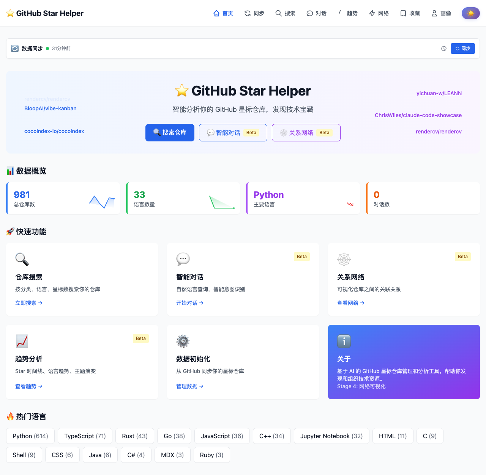
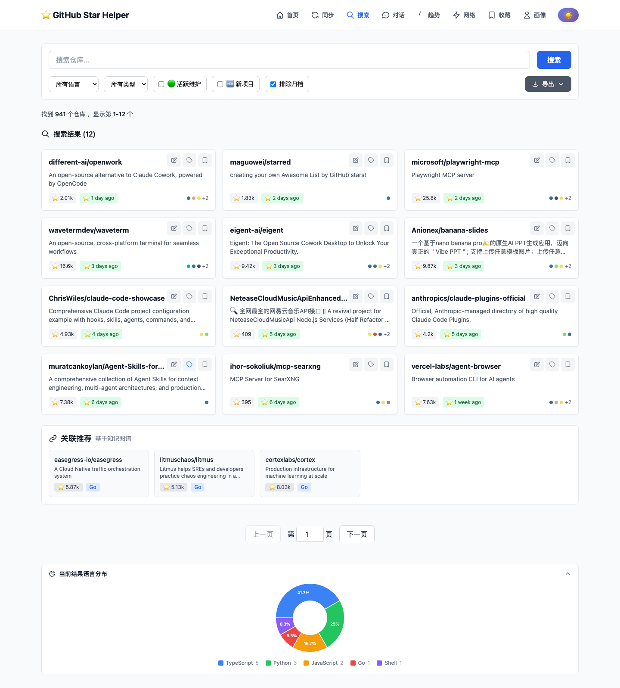
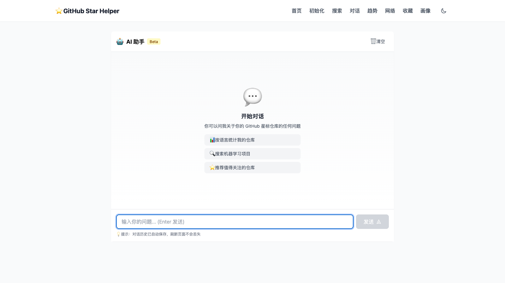
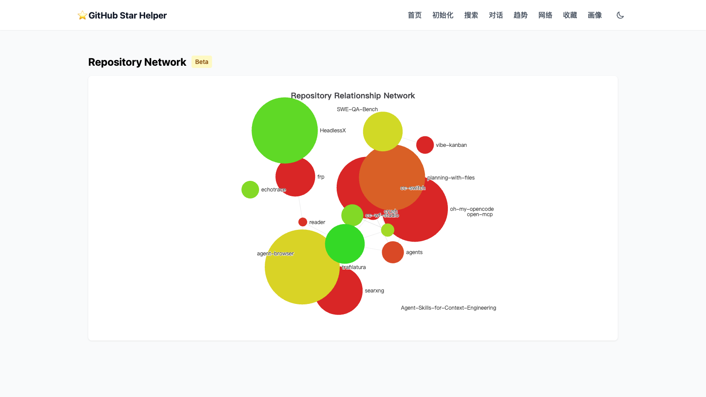
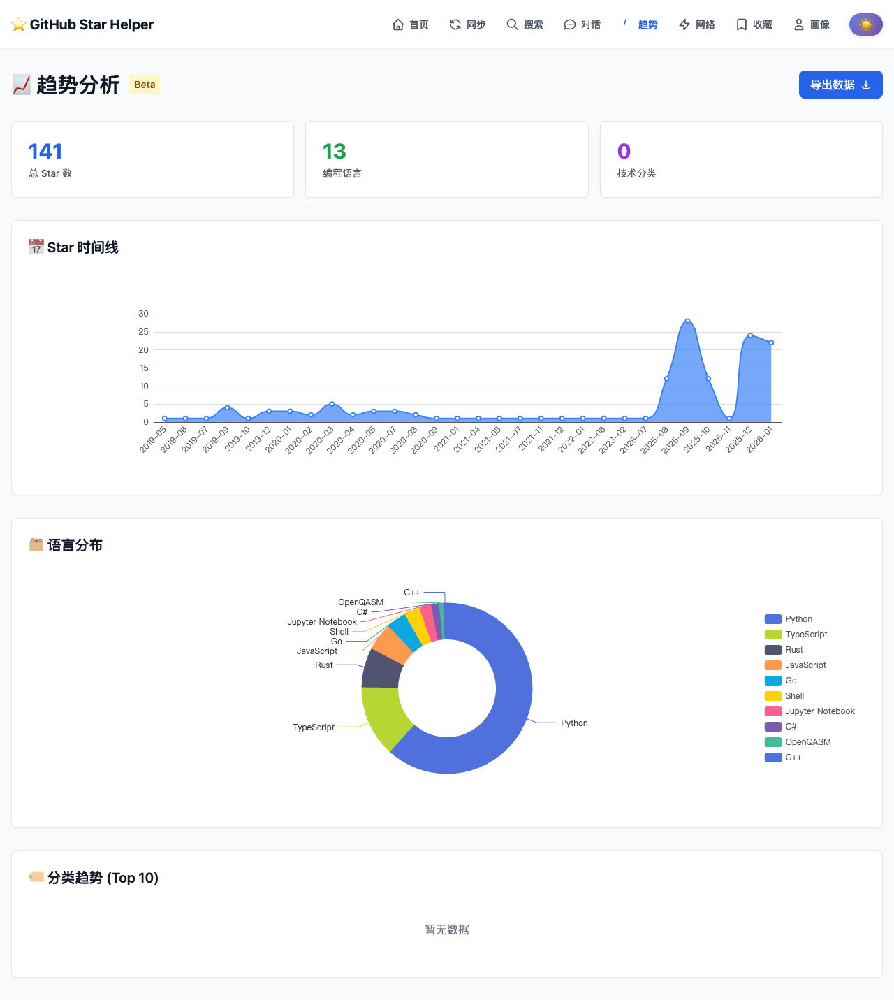

# GitHub Star Helper


**智能的 GitHub 星标仓库管理和分析助手。**

让你的 GitHub stars 不再沉睡。通过语义搜索、AI 对话和趋势分析，将星标仓库转化为个人技术知识库——发现隐藏的宝藏，分析技术趋势，生成学习路径，让收藏的项目真正为你所用。

## 界面预览

### 首页 🏠

快速了解你的 GitHub 星标概况——总项目数、语言分布、最近收藏。

### 搜索页 🔍

混合搜索：结合全文检索和语义理解，精准找到你需要的项目。

### 聊天页 💬

AI 对话助手：自然语言查询，智能意图识别，流式响应。

### 网络可视化 🕸️

项目关系图谱：基于相似度的力导向图，发现项目间的关联。

### 趋势分析 📈

技术成长轨迹：Star 时间线、语言演变、分类趋势的可视化分析。

---

## 快速开始

### Docker 部署（推荐）

最快速的方式是使用 Docker。详细部署指南请查看 **[DEPLOYMENT.md](DEPLOYMENT.md)**。

**一键启动：**
```bash
# 克隆项目
git clone git@github.com:Dustyposa/startship.git
cd startship

# 构建并启动所有服务
docker compose up -d

# 查看服务状态
docker compose ps

# 停止服务
docker compose down
```

**访问地址：**
- 前端：http://localhost:3001
- 后端 API：http://localhost:8889

### 本地开发

**环境要求：**
- Python 3.13+
- Node.js 18+（前端）
- Ollama（可选，用于语义搜索）

**安装步骤：**

1. **安装 Python 依赖**
```bash
# 使用 uv（推荐）
uv pip install -e .

# 或使用 pip
pip install -r requirements.txt
```

2. **安装前端依赖**
```bash
cd frontend
npm install
```

3. **配置环境变量**
```bash
cp .env.example .env
# 编辑 .env 文件，设置必要的配置
```

4. **（可选）安装 Ollama 用于语义搜索**
```bash
# 安装 Ollama
curl -fsSL https://ollama.com/install.sh | sh

# 拉取嵌入模型
ollama pull nomic-embed-text
ollama serve
```

5. **启动服务**
```bash
# 启动后端（在项目根目录）
uvicorn src.api.app:app --reload --host 0.0.0.0 --port 8889

# 启动前端（在 frontend 目录）
npm run dev -- --port 3001
```

6. **访问应用**
- 前端: http://localhost:3001
- 后端 API: http://localhost:8889
- API 文档: http://localhost:8889/docs

---

## 核心功能

### 🔍 智能搜索
- **混合搜索引擎** - 全文检索 + 语义向量搜索，精准定位目标项目
- **多维度过滤** - 按语言、活跃度、项目类型、所有者类型快速筛选
  - 🟢 活跃维护（7天内有提交）
  - 🆕 新项目（6个月内创建）
  - 🏢 组织 / 👤 个人
  - 排除归档项目
- **查询扩展** - AI 自动理解意图，扩展相关关键词

### 💬 AI 对话助手
- **基于你的星标仓库** - 所有对话和分析都围绕你的收藏展开
- **智能意图识别** - 自动区分查询、统计、推荐等不同意图
- **流式响应** - SSE 实时返回，流畅的对话体验
- **上下文记忆** - 多轮对话，理解你的连续需求

### 📝 笔记与标签
- **个人笔记** - 为每个仓库添加学习笔记和使用心得
- **自定义标签** - 用标签组织项目，建立个人分类体系
- **收藏夹管理** - 创建收藏夹，按主题或项目分组收藏

### 🔄 智能数据同步
- **增量同步** - 每日自动同步新增的星标仓库
- **全量校验** - 每周完整校验，检测仓库更新和变化
- **软删除保护** - 取消星标时保留笔记和标签，可随时恢复
- **变更检测** - 自动检测 star 数、fork 数、描述等 8 个字段的变化
- **后台定时任务** - 凌晨 2 点增量同步，周日凌晨 3 点全量校验
- **手动触发** - 支持手动增量/全量同步和 AI 重新分析

### 📊 趋势与洞察
- **Star 时间线** - 追溯收藏历史，发现技术兴趣演变
- **语言分布** - 了解技术栈构成，把握技能方向
- **关系图谱** - 项目相似度网络，发现关联宝藏

### 🚀 一键初始化
- 从 GitHub 星标仓库一键导入
- 使用 GitHub 官方字段：活跃度、归档状态、可见性、所有者类型
- 可选 LLM 深度分析，自动分类标签
- 可选向量嵌入，启用语义搜索

---

## 技术架构

### 后端
- **框架**: FastAPI - 高性能异步 Python Web 框架
- **数据库**: SQLite + FTS5 全文搜索
- **向量**: ChromaDB - 语义搜索存储
- **嵌入**: Ollama nomic-embed-text - 本地向量化
- **AI**: OpenAI GPT - 意图识别与对话生成

### 前端
- **框架**: Vue 3 + TypeScript
- **状态**: Pinia
- **样式**: Tailwind CSS
- **图表**: ECharts - 网络可视化和趋势分析

### 部署
- **容器化**: Docker + Docker Compose
- **前端服务**: nginx (生产环境)
- **开发服务**: Vite (本地开发)

---

## 项目结构

### Docker 部署文件
- `docker-compose.yml` - Docker 编排配置
- `Dockerfile.backend` - 后端 Docker 镜像
- `Dockerfile.frontend` - 前端 Docker 镜像（多阶段构建 + nginx）
- `docker-nginx.conf` - nginx 配置（含 API 代理）
- `DEPLOYMENT.md` - 详细部署指南

### 目录结构
```
startship/
├── src/                          # 后端源代码
│   ├── api/                      # API 层
│   │   ├── app.py                # FastAPI 应用
│   │   └── routes/               # API 路由
│   │       ├── chat.py           # 聊天接口（含意图识别）
│   │       ├── search.py         # 搜索接口
│   │       ├── init.py           # 初始化接口
│   │       ├── trends.py         # 趋势分析接口
│   │       └── network.py        # 网络可视化接口
│   ├── config.py                 # 配置管理
│   ├── data/                     # 数据模型
│   ├── db/                       # 数据库层
│   │   ├── base.py               # 数据库抽象
│   │   └── sqlite.py             # SQLite 实现
│   ├── github/                   # GitHub API
│   │   ├── client.py             # GitHub API 客户端
│   │   ├── models.py             # GitHub 数据模型
│   │   └── graphql.py            # GraphQL 查询
│   ├── llm/                      # LLM 抽象层
│   │   ├── base.py               # LLM 抽象接口
│   │   └── openai.py             # OpenAI 实现
│   ├── services/                 # 业务逻辑
│   │   ├── intent.py             # 意图识别
│   │   ├── search.py             # 搜索服务
│   │   ├── chat.py               # 聊天服务
│   │   ├── stats.py              # 统计服务
│   │   ├── hybrid_search.py      # 混合搜索
│   │   ├── init.py               # 初始化服务
│   │   ├── sync.py               # 同步服务
│   │   ├── scheduler.py          # 定时任务调度器
│   │   ├── network.py            # 网络分析服务
│   │   ├── trend_analysis.py     # 趋势分析服务
│   │   ├── recommendation.py     # 推荐服务
│   │   ├── context.py            # 对话上下文
│   │   └── query_expander.py     # 查询扩展
│   └── vector/                   # 向量搜索
│       ├── embeddings.py         # Ollama 嵌入
│       └── semantic.py           # 语义搜索 (ChromaDB)
├── frontend/                     # 前端 (Vue 3)
│   └── src/
│       ├── views/                # 页面组件
│       │   ├── HomeView.vue      # 首页
│       │   ├── InitView.vue      # 初始化页
│       │   ├── SearchView.vue    # 搜索页
│       │   ├── ChatView.vue      # 聊天页
│       │   ├── NetworkView.vue   # 网络可视化页
│       │   ├── TrendView.vue     # 趋势分析页
│       │   ├── RepoDetailView.vue # 仓库详情页
│       │   ├── CollectionsView.vue # 收藏页
│       │   ├── TechProfileView.vue # 技术画像页
│       │   ├── SyncHistoryView.vue # 同步历史页
│       │   └── DeletedReposView.vue # 已删除仓库页
│       ├── components/           # 可复用组件
│       │   └── SyncStatus.vue    # 同步状态组件
│       ├── composables/          # 组合式函数
│       ├── router/               # 路由配置
│       ├── stores/               # Pinia 状态管理
│       └── types/                # TypeScript 类型
├── tests/                        # 测试套件
│   └── unit/                     # 单元测试
├── data/                         # 数据目录
│   └── github_stars.db           # SQLite 数据库
├── assets/                       # 资源文件
│   └── *.png                     # 界面截图
├── product_plan.md               # 产品计划（详细架构设计）
├── pyproject.toml                # Python 项目配置
└── README.md                     # 项目说明
```

---

## 核心使用场景

### 📊 年度技术总结
> "生成我的 2024 年度 GitHub 总结"

分析你的 star 历史，生成技术栈分布、项目亮点、成长趋势的可视化报告。

### 🎯 技术栈深度研究
> "我想深入了解 Rust 生态，推荐一些优质项目"

基于你的收藏，提供 Rust 核心库、工具链、应用案例的分类推荐和学习路径。

### 💎 发现被遗忘的宝藏
> "帮我找找那些被遗忘的宝藏项目"

根据项目质量、更新活跃度等维度，挖掘你收藏中的隐藏宝石。

### 📈 技术趋势分析
> "分析一下前端框架的技术趋势"

对比 React、Vue、Angular 等框架的发展趋势、社区活跃度，辅助选型决策。

### 🛤️ 学习路径规划
> "我会 Python 和 Django，想学习云原生技术"

基于你的技能基础，推荐 Docker → Kubernetes → 微服务的渐进式学习路径。

### ⚖️ 技术选型对比
> "对比一下 FastAPI 和 Flask 的优缺点"

从性能、生态、学习曲线等维度对比，根据项目需求给出建议。

---

## 开发指南

### 本地开发

1. **启动后端开发服务器**
```bash
uvicorn src.api.app:app --reload --host 0.0.0.0 --port 8889
```

2. **启动前端开发服务器**
```bash
cd frontend
npm run dev -- --port 3001
```

3. **运行测试**
```bash
# 运行所有测试（单元 + 集成）
pytest

# 只运行单元测试
pytest tests/unit/

# 只运行集成测试
pytest tests/integration/

# 运行特定测试文件
pytest tests/unit/test_sync_service.py -v

# 查看覆盖率
pytest --cov=src tests/
```

4. **代码格式化**
```bash
# Python
black src/
ruff check src/ --fix

# TypeScript
cd frontend
npm run lint
npm run format
```

### 扩展功能

1. **添加新的意图类型**
   - 在 `src/services/intent.py` 中添加新的 `IntentResult` 类型
   - 在 `src/api/routes/chat.py` 的 `chat_stream` 中添加处理逻辑

2. **调整混合搜索权重**
   - 修改 `src/services/hybrid_search.py` 中的 `fts_weight` 和 `semantic_weight`

3. **自定义嵌入模型**
   - 修改 `src/vector/embeddings.py` 使用不同的 Ollama 模型或其他嵌入服务

---

## 配置说明

### 环境变量

创建 `.env` 文件并配置以下变量：

```bash
# GitHub
GITHUB_TOKEN=ghp_xxx  # GitHub 个人访问令牌（提高 API 限制，同步功能必需）

# OpenAI
OPENAI_API_KEY=sk-xxx  # OpenAI API 密钥（用于 LLM）
OPENAI_BASE_URL=https://api.openai.com/v1  # 可选：自定义 API 端点

# Ollama（用于语义搜索）
OLLAMA_BASE_URL=http://localhost:11434  # Ollama 服务地址

# 数据库
DB_TYPE=sqlite  # 数据库类型
SQLITE_PATH=data/github_stars.db  # SQLite 数据库路径

# 向量存储
CHROMADB_PATH=data/chromadb  # ChromaDB 持久化路径
```

### 生产部署

详细的 Docker 部署指南、环境变量配置、故障排查等内容，请查看 **[DEPLOYMENT.md](DEPLOYMENT.md)**。

**快速命令：**
```bash
# Docker 部署（推荐）
docker compose up -d --build

# 查看 Docker 日志
docker compose logs -f backend
docker compose logs -f frontend

# 停止服务
docker compose down
```

---

## API 接口

### REST API

#### 初始化
- `GET /api/init/status` - 获取初始化状态
- `POST /api/init/start` - 开始初始化（从 GitHub stars）

#### 聊天
- `POST /api/chat` - 发送聊天消息（非流式）
- `POST /api/chat/stream` - 流式聊天（带意图识别）
  - SSE 事件类型: `intent`, `content`, `search_results`, `done`
- `GET /api/chat/{session_id}` - 获取对话历史
- `DELETE /api/chat/{session_id}` - 删除对话

#### 搜索
- `GET /api/search` - 搜索仓库（支持多维度过滤）
  - 参数: `q`, `languages`, `is_active`, `is_new`, `owner_type`, `exclude_archived`
- `GET /api/repo/{name_with_owner}` - 获取单个仓库详情

#### 用户数据
- `GET /api/user/notes` - 获取所有笔记
- `POST /api/user/notes` - 创建/更新笔记
- `DELETE /api/user/notes/{name_with_owner}` - 删除笔记
- `GET /api/user/tags` - 获取所有标签
- `POST /api/user/tags` - 创建/更新标签
- `DELETE /api/user/tags/{id}` - 删除标签
- `GET /api/user/collections` - 获取收藏夹列表
- `POST /api/user/collections` - 创建收藏夹
- `PUT /api/user/collections/{id}` - 更新收藏夹
- `DELETE /api/user/collections/{id}` - 删除收藏夹

#### 同步
- `GET /api/sync/status` - 获取同步状态（最后同步时间、仓库数量、待更新数）
- `POST /api/sync/manual` - 手动触发同步
  - 参数: `full_sync` (bool) - 是否全量同步
  - 参数: `reanalyze` (bool) - 是否重新分析所有仓库
- `GET /api/sync/history` - 获取同步历史记录
  - 参数: `limit` - 返回记录数
- `GET /api/sync/repos/deleted` - 获取已删除仓库列表
  - 支持恢复软删除的仓库
- `POST /api/sync/repo/{name}/restore` - 恢复已删除的仓库
- `POST /api/sync/repo/{name}/reanalyze` - 重新分析单个仓库（AI）

#### 系统
- `GET /` - 根路径
- `GET /health` - 健康检查
- `GET /stats` - 获取服务统计

### 交互式文档
访问 http://localhost:8889/docs 查看 Swagger UI 文档

---

## 故障排除

### 常见问题

1. **Ollama 连接失败**
   - 确保 Ollama 服务正在运行: `ollama serve`
   - 验证嵌入模型已安装: `ollama list`
   - 检查 `OLLAMA_BASE_URL` 配置是否正确

2. **ChromaDB 初始化错误**
   - 确保有写入权限到 `data/chromadb` 目录
   - 如果出现持久化错误，尝试删除 `data/chromadb` 重新初始化

3. **GitHub API 限制**
   - 配置 `GITHUB_TOKEN` 提高请求限制
   - 使用 `max_repos` 参数限制初始化数量

4. **语义搜索不工作**
   - 确保初始化时启用了 `enable_semantic`
   - 检查 Ollama 服务可访问性
   - 查看后端日志获取详细错误信息

5. **前端无法连接后端**
   - 检查后端是否运行在 http://localhost:8889
   - 验证 CORS 配置
   - 查看浏览器控制台错误信息

---

## 产品计划

### 项目愿景

构建面向个人开发者的 GitHub 星标仓库智能管理工具，让收藏的项目真正成为个人技术知识库。

### 技术路线图

#### ✅ 第一阶段：核心功能（已完成）
- **基础架构**: FastAPI + Vue 3 + SQLite 全栈应用
- **数据导入**: 从 GitHub API 一键导入星标仓库
- **智能搜索**: 全文检索 + 语义向量搜索 `🤖`
- **AI 对话**: 基于意图识别的智能问答 `🤖`
- **RAG 增强**: 检索增强生成，基于仓库内容回答 `🤖`
- **数据可视化**: 网络图谱、趋势分析

#### ✅ 第二阶段：知识管理（已完成）
- **多维度筛选**: 使用 GitHub 官方字段（活跃度、归档、所有者类型）
- **笔记功能**: 为仓库添加个人笔记
- **标签系统**: 自定义标签组织项目
- **收藏夹管理**: 创建收藏夹分组收藏
- **Docker 部署**: 一键部署方案 ✅

#### 📋 第三阶段：智能增强（规划中）
- **缓存优化**: Redis 缓存提升性能
- **深度分析**: README 解析和代码分析 `🤖`
- **协作功能**: 多用户支持和团队协作
- **可观测性**: 日志、监控、告警系统

> `🤖` 标记表示该功能依赖 LLM 服务

---

## 贡献指南

1. Fork 项目
2. 创建功能分支
3. 提交更改
4. 推送到分支
5. 创建 Pull Request

## 许可证

MIT License

## 联系方式

如有问题或建议，请创建 Issue 或联系项目维护者。
